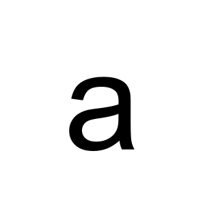

## For reference: graphviz

Should be an image:

```{.graphviz}
digraph test {
  size="5,6";
  dpi=300;

  a -> b
}
```

## This works

::::::{.columns}
:::{.column}
Here is some text. Other column is image.
:::
:::{.column}

:::
::::::

## Still good

::::::{.columns}
:::{.column}
Here is some text. Next is the example for convert: 
:::
:::{.column}
```{.convert}
a.png b.png -append -bordercolor red -border 6
```
:::
::::::

## Still good

::::::{.columns}
:::{.column}
And then there is the example for montage:
:::
:::{.column}
```{.montage}
a.png b.png -geometry +3+3 -background red -tile 1x
```
:::
::::::

## This is where it should be

Text


## This one doesn't play nice

This is where the text is.

```{.convert}
a.png -background red 
```

## And this one also doesn't

This is where the text is.

```{.montage}
a.png -background red 
```
